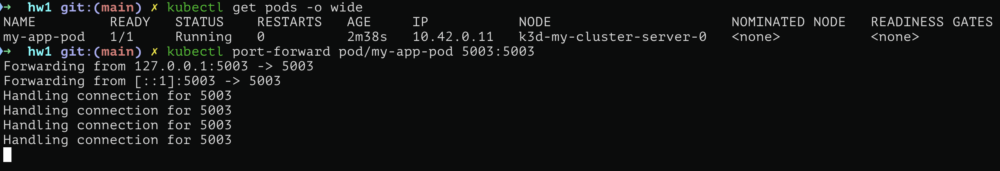
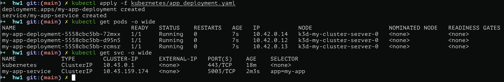
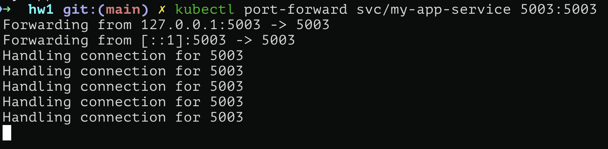
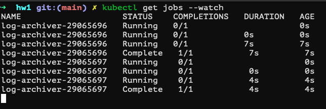
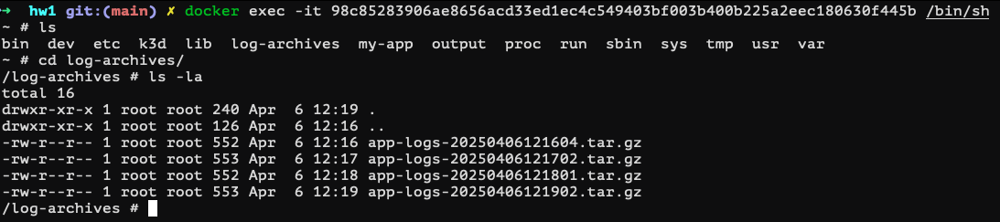

# PPPRP - Домашнее задание: Распределённая система логирования

## Архитектура проекта

Проект реализует распределённую систему логирования на Kubernetes, включающую:

* Flask-приложение с REST API для работы с логами

* Deployment с 3 репликами для отказоустойчивости

* Service для балансировки нагрузки

* DaemonSet с log-агентом для централизованного сбора логов

* CronJob для архивирования логов

## Структура проекта

```
.
├── docker/
│   ├── Dockerfile
│   └── docker-compose.yaml
├── kubernetes/
│   ├── configmap.yaml
│   ├── pod.yaml
│   ├── app_deployment.yaml
│   ├── daemon_set.yaml
│   └── cron_job.yaml
├── my-app/
│   └── app/
│       ├── app.py
│       └── main.py
├── run.sh
├── Makefile
└── README.md
```

## 0. Подготовка окружения

### Сборка Docker образа

```bash
docker build -f docker/Dockerfile -t my-app-img .
```

### Создание Kubernetes кластера (k3d)

```bash
k3d cluster create my-cluster && k3d image import my-app-img --cluster my-cluster
```

## 1. Пользовательское веб-приложение (API)

Приложение на Flask реализует следующие эндпоинты:

| Метод | Путь      | Описание                               |
| ----- | --------- | -------------------------------------- |
| GET   | `/`       | Приветственное сообщение с именем пода |
| GET   | `/status` | Статус сервиса                         |
| POST  | `/log`    | Запись сообщения в лог                 |
| GET   | `/logs`   | Просмотр всех логов                    |

### Особенности реализации:

* Логи пишутся в `/app/logs/app.log`

* Конфигурация загружается из ConfigMap через переменные окружения

* При тестировании обнаружен и исправлен баг с экранированием кавычек в f-строках Python 3.12+

## 2. Тестовый Pod

Для начального тестирования создан отдельный Pod с `emptyDir` для логов.

Манифест: `kubernetes/pod.yaml`

```bash
kubectl apply -f kubernetes/configmap.yaml
kubectl apply -f kubernetes/pod.yaml
```

### Проверка работы:


Проброс портов и тестовый запрос:

```bash
kubectl port-forward pod/my-app-pod 5003:5003
curl http://localhost:5003/
```




## 3. Deployment с репликацией

Создан Deployment с 3 репликами для обеспечения отказоустойчивости.

Манифест: `kubernetes/app_deployment.yaml`

```bash
kubectl apply -f kubernetes/app_deployment.yaml
```

### Проверка:






## 4. Service для балансировки

В манифесте деплоймента уже описан ClusterIP Service. Проверим распределение запросов:

```bash
kubectl run curl-test --image=curlimages/curl -it --rm -- /bin/sh
curl http://my-app-service:5003/
```


Видно, что запросы распределяются между разными подами.

## 5. DaemonSet с log-агентом

Log-агент запускается на каждой ноде и агрегирует логи со всех подов приложения.

Манифест: `kubernetes/daemon_set.yaml`

Принцип работы:

* Поды приложения пишут логи в `/my-app/logs/<pod-name>/app.log` через hostPath

* Log-агент мониторит все поддиректории и агрегирует логи в `/my-app/logs/aggregated-logs/app.log`

* Используется `tail -F` для отслеживания новых записей

```bash
kubectl apply -f kubernetes/daemon_set.yaml
```


## 6. CronJob для архивирования

Каждые 10 минут (для тестирования — 1 минута) создаётся архив агрегированных логов.

Манифест: `kubernetes/cron_job.yaml`

```bash
kubectl apply -f kubernetes/cron_job.yaml
```

### Проверка:




Архивы на ноде:


## 7. Автоматическое развёртывание

Скрипт `run.sh` автоматизирует полное развёртывание системы:

```bash
bash run.sh
```

Или через Makefile:

```bash
make setup
```
