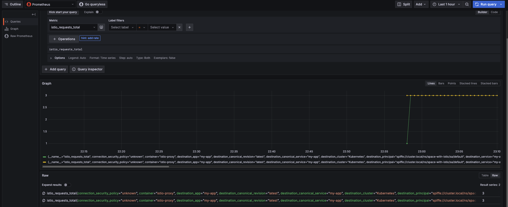
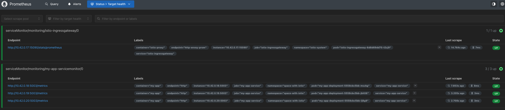
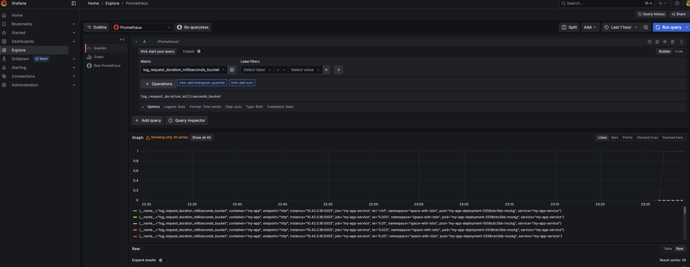

# Добавление мониторинга через Prometheus

## 0. Установка Prometheus

Установим Prometheus с помощью Helm-чарта:

```bash
helm repo add prometheus-community https://prometheus-community.github.io/helm-charts
helm repo update
helm install prometheus prometheus-community/kube-prometheus-stack --namespace monitoring --create-namespace
```

## 1. Настройка Prometheus для сбора метрик с Istio

Пропатчим сервис Istio ingressgateway, чтобы он отвечал Prometheus с порта 15090:

```bash
kubectl -n istio-system patch svc istio-ingressgateway --type='json' -p '[{"op":"add","path":"/spec/ports/-","value":{"name":"http-envoy-prom","protocol":"TCP","port":15090,"targetPort":15090}}]'
```

Создадим ServiceMonitor для обнаружения Istio Prometheus:

```yaml
apiVersion: monitoring.coreos.com/v1
kind: ServiceMonitor
metadata:
  name: istio-ingressgateway
  namespace: monitoring
  labels:
    release: prometheus
spec:
  selector:
    matchLabels:
      istio: ingressgateway
  namespaceSelector:
    matchNames:
    - istio-system
  endpoints:
  - port: http-envoy-prom
    path: /stats/prometheus
    interval: 15s
```

Пробросим порт для доступа к Prometheus:

```bash
kubectl --namespace monitoring port-forward svc/prometheus-kube-prometheus-prometheus 9090
```

Проверим, что ServiceMonitor с Istio ingressgateway отображается во вкладке Status → Target health:


Создадим curl-под и выполним несколько запросов. Затем проверим в Grafana, что метрики корректно отображаются:

```bash
kubectl get secret -n monitoring prometheus-grafana -o jsonpath="{.data.admin-password}" | base64 --decode && echo # пароль
```



## 2. Добавление метрик в пользовательское приложение

Добавим метрики в наше Python-приложение с использованием библиотеки `prometheus_client`:

```python
from prometheus_client import Counter, Histogram, generate_latest, CONTENT_TYPE_LATEST

LOG_REQUEST_COUNT = Counter("log_request_count", "Total number of api/log requests")
SUCCESS_LOG_REQUEST_COUNT = Counter("success_log_request_count", "Total number of successful api/log requests")
FAILED_LOG_REQUEST_COUNT = Counter("failed_log_request_count", "Total number of failed api/log requests")
LOG_REQUEST_DURATION = Histogram("log_request_duration_milliseconds", "Duration of api/log requests")
```

Обновим метрики в соответствующих ситуациях:

```python
@app.route("/api/log/delayed", methods=["POST"])
def log_message_delayed():
    LOG_REQUEST_COUNT.inc()

    delay = random.randint(1, 5)
    start_time = time.time()
    time.sleep(delay)
    LOG_REQUEST_DURATION.observe(time.time() - start_time)

    if random.random() < 0.3:
        FAILED_LOG_REQUEST_COUNT.inc()
        return jsonify({"state": "failed"}), 500
    
    SUCCESS_LOG_REQUEST_COUNT.inc()
    return jsonify({"state": "success"}), 200
```

## 3. Настройка Prometheus для сбора метрик с приложения

Добавим ServiceMonitor для нашего приложения, чтобы Prometheus мог обнаружить его. Укажем, что метрики нужно собирать с endpoint'а `/metrics`:

```yaml
apiVersion: monitoring.coreos.com/v1
kind: ServiceMonitor
metadata:
  name: my-app-servicemonitor
  namespace: monitoring
  labels:
    release: prometheus
spec:
  selector:
    matchLabels:
      app: my-app
  namespaceSelector:
    matchNames:
      - space-with-istio
  endpoints:
    - port: http
      path: /metrics
      interval: 15s
```

Проверим, что Prometheus видит наше приложение:



Убедимся, что метрики отображаются в Grafana:




## 4. Создание единого bash-скрипта для развертки всей системы

Скрипт развертки находится [здесь](run.sh). Запустить его можно следующим образом:

```bash
bash run.sh
```

Либо с помощью [Makefile](Makefile), просто выполнив команду `setup`.